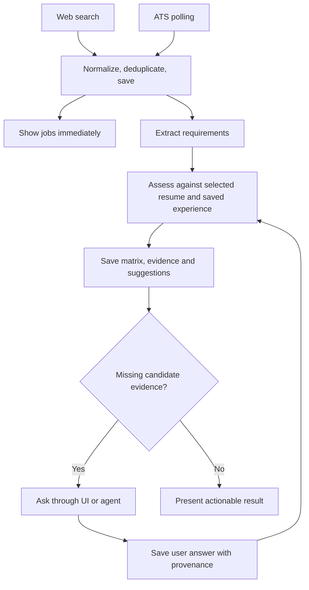

Alright fuck it let's talk about what a gig is! 

A gig is nothing but a set of traversable goal graphs! we will consider where to slot the changes we need to make to get gigai there! 

deep dive:

Let us take scout for example  scout will have many tools available, that can be evaluated and improved! 
Let's say for example underneath exa api isn't performing as expected, these all the fucking levers that higher level models such as astra, even fucking luna dude. 
Lune isn't there to orchestrate.. but gather the evidence of is the tool doing the job based on recent runs.

Search tools 
- web search for jobs
- ATS polling 
- Sample resumes gathering from web search (we don't have that yet but would be good to add)
Matrix determination
- This can be non-deterministic a bit but also can have determinism, that can be tweaked and improved by user 
Saving the state to local
- sqlite, jsonl and all! we should optimize this later on, aka try to store as small footprint as possible.
Suggestions
- The questions asked for a suggestion, for example you have any experience say " working on GCP or RAG models", they are not in your recent resume. user can provide details either in ui or fucking agent asks, once saved on local, agent can pick it up and offer guidance.


So usage of tools + a task is a goal unit right, so searching web + matrix + saving state is a GIG! or baby gig if you must, that's the goal graph! 
That's what is what defines a gig and makes it fucking portable

---

## Assistant response — Gig, goal graphs, tools and saved experience

Discussion recorded 2026-09-21; proposed product framing, not an implemented contract.

**A Gig is a portable set of traversable goal graphs, together with the tools, rules, and state those graphs need.** That is a clear product definition.

I’d keep these four concepts distinct:

| Concept | Meaning | Scout example |
| --- | --- | --- |
| **Tool** | A capability a goal can use | Search postings, poll an ATS, save a record |
| **Goal node** | A task with inputs, allowed tools, an expected result, and a completion check | Find new postings and persist their sources |
| **Goal graph** | Connected goals that perform one useful function | Discover and assess relevant jobs |
| **Gig** | The portable collection of those graphs and their supporting assets | Scout |

So your search → matrix → save workflow is a **goal graph**. Package that single graph with what it needs and it can already be a small, useful Gig. Scout can grow to contain several graphs without changing that definition.

**“Task + tools” is the starting point for a goal node.** The crucial addition is: *what observable result means this task succeeded?* “Called Exa successfully” and “found useful new postings” are different outcomes.

For Scout, I’d express the flow like this:



A traversal can finish with **“assessment saved; questions await answers.”** It doesn’t need to keep an agent running until you respond. Your answer can resume or trigger the relevant assessment work using the saved inputs.

Your GCP/RAG example is exactly why **saved experience and the resume must be distinct**. The resume is a selected presentation of your experience. Missing text means “we lack evidence here,” not “you lack this skill.” An answer entered through the UI or an agent should reach the same local record, so future suggestions can use it.

The matrix can combine both kinds of work:

- **Deterministic:** validate fields, resolve evidence references, detect duplicates, apply explicit user rules.
- **Model-assisted:** interpret a requirement, judge whether experience supports it, formulate a useful question.

The user can change the rubric. Each assessment should retain which rubric and inputs produced it, so improvements don’t silently rewrite yesterday’s meaning.

**The TypeSafe/Jev research belongs at those bounded decision points.** For example: `supported`, `unclear`, `unsupported`, or `not_applicable`, with evidence sufficiency and a next-step decision. The [existing evidence document](spikes/evidence/jev-typesafe-ai-structured-decisions-research.md) already separates typed answers, evidence support, and authority to act. We can use that discipline without deciding to adopt Jev.

Then tool evaluation becomes another useful Scout graph:

**Read recent run evidence → measure performance → investigate failures → propose a change → compare against the baseline.**

Luna’s job there is to examine whether the tool is doing its job. For a search tool, that could mean useful unique postings, duplicates, stale results, failed fetches, latency, and cost. Recent runs expose problems; a controlled comparison helps determine whether changing a query, provider, or routing rule actually improves things.

Finally, portability comes from packaging the graphs **with their tool contracts, customizable rules, evaluations, and state format**. Another machine supplies its own credentials and execution bindings. SQLite versus JSONL—and footprint optimization—can evolve underneath that, provided saved facts and run evidence retain their meaning.

---

## Follow-up point — who acts on Luna's evidence?

The framing above leaves one thing undecided: Luna's role is explicitly evidence-gathering, not orchestrating ("Lune isn't there to orchestrate.. but gather the evidence of is the tool doing the job"). That's correct as a separation of concerns, but it means someone or something still has to *act* on that evidence — and the current definitions don't say who, or under what conditions.

Concretely: Luna reports "Exa is returning stale/duplicate postings at rate X." Three different things could happen next, and they have very different trust and portability implications:

1. **A goal node's tool binding gets swapped automatically** (Exa → alternative search tool) because a threshold was crossed. This is the most autonomous option, but it means a Gig's behavior can silently drift between two runs on two machines if the evaluation loop ran differently on each, and it breaks the traceability point already made about rubrics ("each assessment should retain which rubric and inputs produced it").
2. **A suggestion is raised, but the user (or Astra, if that's the orchestrator layer) approves the swap** before it takes effect. This preserves portability and auditability at the cost of latency — someone has to look at it.
3. **The evaluation just gets logged as run evidence**, and tool selection stays a static part of the Gig's packaged contract until a human edits it deliberately (closer to a config change than an autonomous action).

Given the portability goal already stated — "package that single graph with what it needs" — option 3 or a gated version of option 2 seems more consistent than option 1. If a Gig's tool bindings can mutate themselves based on Luna's evidence without an explicit authority boundary, two copies of the "same" Gig on two machines are no longer guaranteed to behave the same way, which undercuts the "portable" claim as much as an inconsistent state format would.

So: **tool bindings inside a goal graph should probably carry the same kind of provenance/authority discipline already proposed for assessments** — i.e., a tool swap is itself a decision with a rubric, inputs, and an actor (human vs. agent) attached, not a side effect of evaluation. Worth deciding explicitly before Luna's evidence loop is wired to anything that can act on it.

---

## Assistant response — evidence, adoption and tool-binding authority

Discussion continuation; proposed behavior, not an implementation or activation decision.

**Claude’s strongest point is that evaluation evidence doesn’t itself grant permission to change the Gig.** My earlier response described gathering evidence and proposing improvements, but left the adoption step undefined.

For Scout, I’d make that sequence explicit:

| Step | Result |
| --- | --- |
| Evaluate recent search runs | Evidence of stale results, duplicates, coverage, latency |
| Propose an improvement | A specific change: query settings, tool configuration, or provider |
| Test the proposal | Comparison against the current configuration |
| Accept and activate | An authorized, recorded change to the Gig’s configuration |

Luna can perform the first three as assigned goals. **Neither Luna nor Astra gets approval authority simply because it is capable or acting as orchestrator.** That authority comes from you or an explicitly delegated policy.

I’d distinguish two situations:

- **Following an existing rule:** “If Exa times out, use this already-approved alternative within this budget.” That is executing the graph’s configured behavior.
- **Changing the rule:** “Recent results suggest we should replace Exa as the default.” That is a proposed revision requiring the configured approval step.

For your initial use, **a tested proposal that you accept** seems sufficient. We don’t need a new approval framework to express that.

One qualification to Claude’s argument: portability doesn’t guarantee identical results across machines. Search results, models, credentials, and local configuration can differ. What matters is that **the graph and its requirements travel, differences are explicit, and each run records what it actually used**.

So a tool change should record the previous and proposed binding, supporting runs, evaluation criteria, approving actor, and effective configuration revision. Historical runs retain their original configuration.

That closes the missing loop: **a Gig can contain a graph that evaluates and proposes improvements to its own tools; adopting those improvements remains a separate, explicit decision.**

---

## Follow-up point — accepting the correction, tightening one edge

The rule-following vs. rule-changing split is the right resolution — it's a cleaner version of my earlier "gated option 2" without inventing new machinery. Executing a pre-approved fallback within budget is just the graph doing its job; only a change to the rule itself needs the accept/activate step. That should be adopted as the actual mechanism, not just a helpful reframing.

The portability correction is fair too. I said "two copies of the same Gig... are no longer guaranteed to behave the same way" as if that were uniquely caused by autonomous tool-swapping, when in fact — as pointed out — nothing about a portable Gig ever promised identical results across machines; search results and provider state already differ at runtime regardless of who changes the tool binding. So the real risk I was gesturing at isn't "identical behavior breaks," it's narrower: **an unrecorded or unauthorized configuration drift is indistinguishable from ordinary runtime variance unless every run records what it actually used.** That's exactly what the last response's schema (previous/proposed binding, supporting runs, evaluation criteria, approving actor, effective revision) already fixes. So the correction isn't just fair — it makes my original concern moot once that recording discipline exists, rather than needing a separate authority rule to prevent it.

One remaining edge worth naming explicitly before this gets built: **what counts as "already-approved" for the rule-following case has to itself be scoped, or it becomes a loophole back to autonomous rewriting.** "If Exa times out, use this already-approved alternative within this budget" is fine as written because the alternative and the budget are both fixed at approval time. But if the *set* of acceptable fallbacks or the budget itself can be widened by Luna's evidence without a new accept/activate step — "if Exa keeps failing, widen the budget" — that's a rule change wearing rule-following's clothes. So the accept/activate record should bind not just the tool choice but the exact trigger condition and its bounds, and any change to *those* bounds should require the same explicit step as changing the tool itself.

---

## Operator clarification — redefining what a Gig is

**Current product direction, recorded 2026-09-21.** This clarification takes
precedence over the emphasis on improvement/approval machinery in the preceding
discussion. It defines the direction we are building toward; it does not claim
that every part is already implemented.

**A Gig is a portable set of traversable goal graphs, with the tools, execution
bindings, persistent memory and state needed to perform its functions, and
observable costs and storage footprint.** A graph traversal performs one
defined function and leaves a useful result. A Gig may begin with one graph
and grow to contain several.

The purpose of this discussion is to establish those foundations. The earlier
responses let a future improvement workflow dominate the discussion. That is
not the current scope.

### Build Scout, learn from it, extract reusable pieces

Scout is the first shippable Gig. **Keep building and shipping Scout.** Do not
stop its work to build a generalized orchestration or self-improvement
framework. Learn from its actual behavior and extract reusable tools and
boundaries as their responsibilities become clear. The Phase 2 story work
continues; this discussion is not a stop instruction.

The foundations should let the Gig's parts be replaced and improved:

- **Traversable goal graphs:** connected tasks with clear inputs, expected
  outputs and completion criteria. One traversal produces a useful outcome;
  individual nodes can run sequentially or independently as the graph requires.
- **Replaceable tools:** web search is a tool capability; Exa is one possible
  implementation. ATS polling and gathering sample resumes are other Scout
  capability examples, with sample-resume gathering still a proposed addition.
  A goal depends on the tool's contract rather than a provider-specific
  implementation. Reuse existing tool patterns and libraries where suitable.
- **Replaceable execution:** deterministic code or an appropriate model can
  perform a node's work where its contract permits. Models and agent harnesses
  are execution choices, not the identity of the Gig. Luna can gather and
  interpret evidence without becoming the orchestrator.
- **Persistent memory and state:** experience, preferences, source material,
  results and provenance survive individual runs and agent sessions. The resume
  remains a selected presentation of saved experience. UI and agent input reach
  the same local facts so later goals can use them.
- **Observable costs and footprint:** make execution cost, latency and storage
  growth inspectable. Optimize footprint as we learn; SQLite, JSONL and other
  storage choices are implementation details whose evolution must preserve
  the meaning of saved state and evidence.
- **Portability:** graphs, tool contracts, customizable rules, evaluations and
  owned assets can travel with the Gig. Local credentials and execution
  bindings remain explicit. Portability does not promise identical search or
  model results on every machine.

“Swappable” is the foundational direction, not a demand to design every
possible replacement upfront. Build against clear boundaries, prove them in
Scout, and extract what is actually reusable. Keep the first useful Gig moving.

### Improve is a later chapter

An explicit suggested-improvements workflow, illustratively
`gigai improve scout-kar`, may come in a later version—perhaps 0.20 or beyond;
that is not a scheduled commitment or a claim that the command exists.

The eventual workflow can gather evidence, propose changes and present them
through an agent or a dedicated Improve UI. **The person operating that Gig
is the ultimate decider**; an agent asks that person before adopting an
improvement. This applies to any operator, not only the current developer.

Record this future direction without making it a prerequisite for Scout.
Today's work is the Gig foundation: traversable graphs, replaceable tools and
execution, persistent memory/state, manageable footprint and visible costs.

---

## Discussion continuation — composing tools and goal units into graphs

Recorded 2026-09-22. Product/design discussion; the illustrative definitions
below are not a new implemented schema or an instruction to replace runtime code.

### Operator clarification

The discussion is not a request to change search providers now. We build the
base tools and base node graphs that we think are useful. Scout has a set of
those graphs. Agents can later come in and change or extend them. The question
to answer now is **how to build the foundation that lets tools and goal units
be composed into a node graph**.

### Assistant response

**The question is composition: how do we define base tools and goal units so
they form an executable node graph?** I kept jumping ahead to what agents
might change later.

I’d define the pieces like this:

| Piece | What it defines |
| --- | --- |
| **Tool** | A callable capability: inputs, outputs, and execution behavior |
| **Goal unit** | A task, the tools it can use, the inputs it needs, its expected output, and how completion is checked |
| **Graph node** | An instance of a goal unit, configured for that position in the graph |
| **Graph edge** | Where a node gets its inputs and what result allows execution to proceed |
| **Goal graph** | Those nodes and connections, with an entry point and a completion condition |

For example, a base Scout graph could compose:

```text
Discover postings
    tools: web search, ATS polling
    output: saved posting references
            ↓
Determine requirements
    tools: posting reader, structured extraction
    output: requirements matrix
            ↓
Assess against experience
    tools: saved-experience reader, assessment
    output: assessment + evidence + questions
```

The enabling mechanism is **compatible input/output contracts and explicit
connections**. A goal unit produces a result another goal unit can consume.
The runner follows those connections, invokes each goal’s implementation,
checks completion, and records the traversal.

Scout ships with the base tools, goal units, and useful graphs we author.
Agents can subsequently edit or extend those definitions through the same
composition mechanism.

**That’s the foundation to design: tool definitions → goal-unit definitions →
graph composition → execution.**

### Next discussion topics — spikes not yet created

The operator requested two separate spikes after moving this discussion into
the v0.1.8 worktree, but explicitly asked not to create them yet:

1. **Tools and goal-unit composition:** define how base tools and goal units
   become traversable node graphs, grounded in Scout and existing GigAI support.
2. **Existing job-discovery solutions:** investigate how others already solve
   discovering postings, including reusable tools and approaches. We are not
   the first to solve this; research existing work before deciding what to build.

This note records the intended topics only. No new spike, research execution,
provider change or implementation is authorized by this move.
