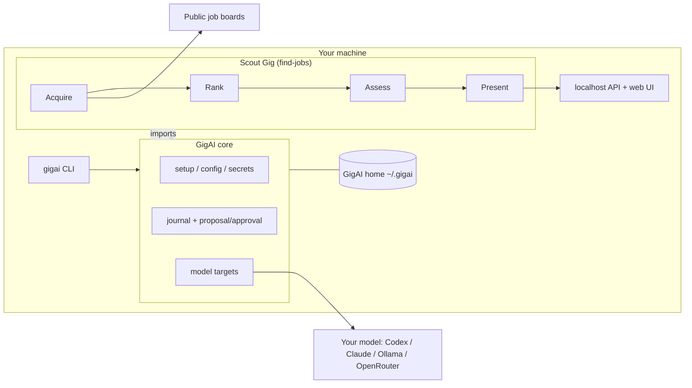

GigAI is two layers with a one-way dependency: **a Gig imports GigAI core; GigAI
core never imports a Gig.** Scout ships with GigAI today but gets no special
runtime treatment.

## Where things live

| Path | Owner | What |
| --- | --- | --- |
| `src/gigai/` | core | setup, config, journal, proposal/approval lifecycle, catalog, package boundary |
| `src/gigai/scout/` | Scout | `find_jobs/` (acquire, assess, present), goal-graph data, `ui/` |
| `~/.gigai/config.toml` | core | settings, model targets, credential references (names, never values) |
| `~/.gigai/scout/` | Scout | the Scout project: `find-jobs.json`, resumes, tailored resumes |

## Model targets

A model target names an adapter (`codex_cli`, `claude_cli`, `ollama_local`,
`openrouter_api`) and a model. `gigai setup` creates one per CLI it finds
(`codex-default`, `claude-default`); Scout's searches resolve the sealed adapter
name to whichever enabled target uses it.
