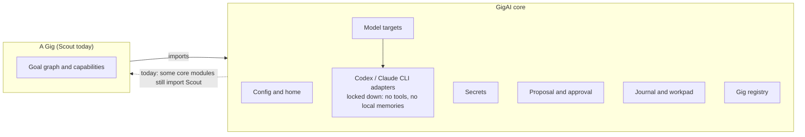

GigAI is two layers with a one-way dependency direction: **a Gig imports GigAI
core, and GigAI core is meant not to import a Gig.** Today that is the rule the
code is moving toward, not yet a fact: Scout ships in the same package as core,
and core still imports some Scout modules (the `gigai scout` command groups in
`cli.py`, `run.py`, `default_init.py` and a few others). Scout gets no special
runtime treatment.

<!--
Grounding (src/gigai/...): Config/home = config.py (config_path, load_config; ~/.gigai/config.toml).
Secrets = secrets_store.py (get/set/names_set) + secrets_catalog.py (KNOWN_SERVICES).
Model targets = model_targets.py resolve_model_target; adapters = adapters/codex_cli.py
(_CODEX_HARDENING: --disable shell_tool, --disable memories), adapters/claude_cli.py
(_CLAUDE_HARDENING: --setting-sources "", --strict-mcp-config, --tools "").
Proposal/approval = lifecycle.py (create_offline, approve_offline, revise_offline, reject_offline).
Journal/workpad = journal.py (JournalEntry), workpad.py (resolve_workpad). Gig registry = registry.py
(ProjectRegistry: ProjectRecord, WorkpadRecord(gig_id)). Scout = src/gigai/scout/ (scout/find_jobs/bindings.py registers its graph nodes with graph_node_registry.py).
Gig -> core imports: scout/find_jobs/bindings.py "from ...config", "from ...graph_node_registry".
Core -> Scout imports (dashed): cli.py:48-53 (scout command groups), run.py:56, default_init.py:28,
external_recording.py:37, private_transfer.py:31, capability_review.py:35, capability_successor.py:41.
-->

The solid arrow is the direction Gigs are built for. The dotted one is the
current state of the code: it is why the boundary is described as a direction
and not as a guarantee.

## Where things live

| Path | Owner | What |
| --- | --- | --- |
| `src/gigai/` | core | setup, config, journal, proposal/approval lifecycle, catalog, package boundary |
| `src/gigai/scout/` | Scout | `find_jobs/` (acquire, assess, present), goal-graph data, `ui/` |
| `~/.gigai/config.toml` | core | settings, model targets, credential references (names, never values) |
| `~/.gigai/scout/` | Scout | the Scout project: `find-jobs.json`, resumes, tailored resumes |

Model targets are covered in [Model targets](../model-targets/).
