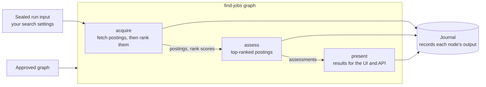

A **Gig** is a self-contained goal-graph package built on top of GigAI core.
The dependency is meant to run in one direction only: **a Gig imports GigAI
core, and GigAI core is meant not to import a Gig.** Today Scout ships in the
same package and core still imports some Scout modules (the `gigai scout`
command groups in `cli.py`, `run.py`, `default_init.py` and a few others), so
this is the direction Gigs are built for, not yet a guarantee. Gigs are
portable, reviewable units of work, not plugins the runtime depends on.

Scout is one Gig among others GigAI can host; it gets no special runtime
treatment. It ships with GigAI and has its own bundled goal-graph data under
`src/gigai/scout/`.

## Goal graphs

A Gig's work is described by a **goal graph**: each node is one goal run by a
named capability, each edge says "run this after that one completes", and the
runtime works through it in order. What a node produces is sealed and recorded in
the journal, and the next node builds on that sealed output. Approval comes first: a graph runs only after you approve it
through the proposal/approval lifecycle, and an approved graph does not change
under a run.

Scout's `find-jobs` graph is the worked example. It has three goals joined by
two automatic edges. Ranking is not a node of its own: it is a step inside the
acquire goal, and its scores are sealed into the acquire output.

<!--
Grounding (src/gigai/scout/...): graph selector find-jobs-functional = find_jobs/bindings.py GRAPH_ID;
three goals + two automatic COMPLETE dependency edges = materialization.py
_find_jobs_functional_graph_and_descriptor (goals acquire, assess, present; edges goal[0]->goal[1]->goal[2]);
node capabilities = find_jobs/contracts.py ACQUIRE_CAPABILITY "scout.find_jobs.acquire", ASSESS_CAPABILITY,
PRESENT_CAPABILITY, registered in bindings.py register(...) lines 971-973;
rank step inside acquire = find_jobs/market_acquisition.py _rank_candidates (called from the acquire node),
scores sealed as AcquireOutput.rank_scores (contracts.py) and re-read by assess (proposal_execution.py
rank_run.sealed_rank_scores); assess picks top-ranked postings via find_jobs/selection.py select_for_assessment;
present = projection.py present_node; sealed input = the run's sealed FindJobsConfig (rank_run.rank_prefs);
journal entries = outputs committed through the workpad journal (rank_run.seal_rank_json, journal.py);
approval = lifecycle.py approve_offline (the graph is approved before any run).
-->

## Registering and activating a Gig

- `gigai init` binds a git repository as a GigAI project and `gigai gigs` lists
  the Gigs registered for it.
- If a project has more than one installed, approved Gig, `gigai gig use <gig-id>`
  switches which one is active.
- Installing a Gig goes through the proposal/approval lifecycle: an install
  binds, approves, and activates it (for Scout that is one command).

See [Architecture](../architecture/) for where the pieces live and the
[CLI reference](../../reference/cli/) for every command.
