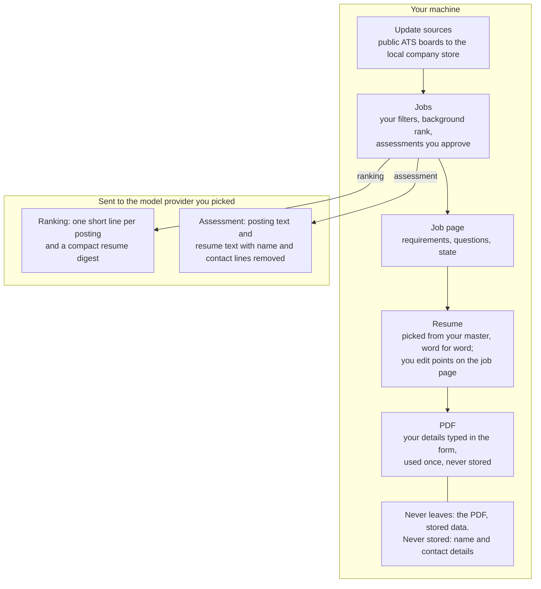

**Scout** implements `find-jobs`, a job-search workflow. It ships with GigAI and
gets no special runtime treatment: it is one Gig among others GigAI can host.

- **Acquire**: pull public postings from the Greenhouse/Lever/Ashby
  applicant-tracking boards through an auto-managed watchlist, plus Exa
  search if you turn it on (it is off for a new setup).
- **Rank**: every posting that passes your filters (titles, titles to
  avoid, location, the publication window, work mode) is ranked by the model
  target you already use, and results stream in as batches finish. The order
  is honest but coarse: *likely fits first, likely no-matches last*. It
  pre-filters hard blockers (a no-sponsorship or citizenship line, a
  clearance requirement) by moving those postings down, never by hiding
  them. It does not claim to put the best match first.
- **Assess**: build a requirements-by-resume matrix for the postings you
  approve (Scout asks first, with the count and an estimate). Defaults to a local model
  target; hosted targets are only used when explicitly configured.
- **Present**: a localhost API and a small web UI show acquired and assessed
  postings. What your model target sees is
  exactly what leaves your machine for ranking and assessment; the other
  network traffic is listed in [Privacy and security](privacy/).

Everything Scout writes stays under your configured GigAI home and the bound
project's workpad. Each job's resume (picked from your master; `gigai scout resume tailor` is switched off in 0.1.11) is stored under the gig too (`scout/<project>/resumes/`,
ephemeral pasted-resume runs under `ephemeral/`) and contain resume-derived
text by design. The picked resume is word for word from your master: review each line.
Two confirming live runs on the release candidate (155 and 151 lines) found no fabricated facts
once one judge-flagged plural ("Kubernetes platforms" for the source's "Kubernetes platform") was
reviewed as a wording difference, not a new fact; 1 minor precision flag in each run (0.6% and 0.66% of lines).

## How Scout fits together

The diagram shows the steps in order and where your data goes. The boundary is
the one in [Privacy and security](privacy/): your model target sees ranking
lines with a compact resume digest, and the posting text plus your resume with
name and contact lines removed for assessment and tailoring. The PDF and
everything Scout stores stay on this machine, and Scout stores no name or contact
details: you type them when you make a PDF. With a local Ollama target nothing
goes to a provider.

<!--
Grounding (src/gigai/scout/...): Update sources = find_jobs/sources_update.py (one conditional GET per
board; Greenhouse/Lever/Ashby via find_jobs/ats_board_clients.py), stored in find_jobs/company_index.py
(<home>/cache/scout/companies/). Find jobs: filters = find_jobs/filters.py; rank = find_jobs/model_rank.py +
find_jobs/rank_run.py on the run's model target; assessment of top-ranked / all new = find_jobs/selection.py,
find_jobs/assess_all.py, proposal_execution.py. Job page state = find_jobs/job_state.py. Resume = pick.py (picked from the master at
assessment, word for word) + ui/src/components/JobResumePanel.jsx, ResumePreview.jsx, ResumePoints.jsx (tailoring is off by default).
PDF = resume_pdf.py render_pdf; the header comes from the Generate PDF form (ui/src/components/GeneratePdfForm.jsx), used for that one render and never stored (0110-046).
Jobs page = posting_search.py search_postings (no run); background = pipeline/runner.py, pipeline/steps.py, pipeline/rank_lane.py.
Privacy edge to the model = resume_privacy.py model_resume (name and contact lines removed) for assess, tailor;
rank digest = find_jobs/rank_digest.py (compact digest). Wording = scout/privacy.md.
-->

## Where to go next

- [Your first 10 minutes](first-10-minutes/): install, set up a profile, ask your agent what is new, make a PDF.
- [Quickstart](quickstart/): from zero to a running Scout.
- [Privacy and security](privacy/): read this before you add a resume.
- [Resume and PDF](resume/): preparing a resume, the picked resume, the PDF.
- [What Scout's numbers and labels mean](numbers/): rank, verdict, Scout label, Scout ATS score.
- [Update sources](sources/) and [Configuration](configuration/): the company store, `find-jobs.json`, Exa.
- [For agents](agents/): the daily workflow from your own AI agent, setup, the security model.
- [Start here](agents/start/): the page you give your agent so it sets GigAI up for you.
- [Token usage](tokens/): what each step costs in tokens and time, on Codex and on Claude Code.
- [Known limitations](limitations/) and [Roadmap](roadmap/).
